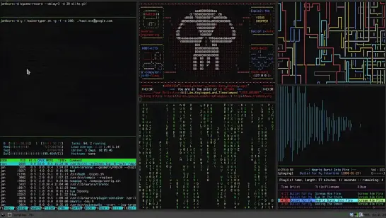

<!-- MATRIX CYBER SECURITY HEADER -->

<p align="center">

</p>

<h1 align="center">🛡 Cybersecurity Monitoring Dashboard</h1>

<p align="center">
Real-Time Threat Monitoring • SOC Simulation • Cyberpunk Security Interface
</p>

---

# ⚡ Matrix System Boot

```
> Accessing SOC system...
> Loading threat intelligence...
> Initializing network scanner...
> Activating intrusion detection...
> Cyber defense system ONLINE
```

---

# 🚀 Project Overview

The **Cybersecurity Monitoring Dashboard** is a futuristic interface inspired by **Security Operations Center (SOC)** environments used by cybersecurity teams.

This project simulates various monitoring tools such as:

• cyber attack visualization  
• network monitoring  
• IP tracking system  
• packet analyzer  
• hacker terminal console  

The UI follows a **dark neon cyberpunk theme inspired by hacker dashboards**.

---

# 🌐 Live Demo

View the project:

https://raja-kumar-1996.github.io/Matrix-Animation-Login/

---

# 🌍 Global Cyber Attack Map

<p align="center">


</p>

This dashboard simulates **real-time cyber attack monitoring** similar to global security platforms such as:

• Kaspersky Threat Map  
• FireEye Cyber Map  
• Norse Attack Map  

Future versions may integrate **real threat intelligence APIs**.

---

# 🌍 3D Cyber Attack Globe

<p align="center">


</p>

Planned implementation:

• **Three.js 3D globe visualization**  
• **attack path animations**  
• **real-time threat data**  

Example attack log:

```
Origin: Russia
Target: Germany
Protocol: SSH
Threat Level: Medium
Status: Blocked
```

---

# 🧠 AI Threat Detection System

The dashboard includes a simulated **AI-powered security monitoring engine**.

Example system report:

```
AI Threat Detection Report
--------------------------

Firewall Status: Active
Intrusion Attempts: 3
Suspicious Packets: 12
Threat Level: LOW
System Status: Secure
```

This demonstrates how **machine learning models could detect suspicious activity** in real SOC platforms.

---

# 📊 Real Security Metrics

<p align="center">


</p>

These charts display **developer activity and repository contributions**.

---

# 📈 Technology Usage

<p align="center">


</p>

---

# 📊 Interactive Dashboard Preview

<p align="center">


</p>

Modules included in the dashboard:

• Network monitoring  
• Packet analyzer  
• Security logs  
• Intrusion detection  
• Terminal console  

These simulate **real tools used in cybersecurity SOC environments**.

---

# 💻 Hacker Terminal Console

The dashboard includes a **command terminal simulation**.

Available commands:

```
help
scan
clear
status
```

Example usage:

```
> help
Available commands:
scan  - scan network
status - system health
clear - clear terminal

> scan
Scanning network...
Threats detected: 0
System secure
```

---

# 🧰 Technologies Used

| Technology | Purpose |
|-------------|--------|
| HTML5 | Page structure |
| CSS3 | Cyberpunk UI design |
| JavaScript | Dashboard logic |
| Canvas API | Matrix animation |
| Chart visualization | Security metrics |

---

# 📂 Project Structure

```
Cybersecurity-Dashboard
│
├── index.html
├── style.css
├── script.js
├── assets
│   ├── dashboard.png
│   ├── matrix.gif
│   └── world-map.png
└── README.md
```

---

# 🛡 Dashboard Modules

### Network Monitoring
Displays simulated network traffic logs.

### IP Tracking
Random IP addresses simulate intrusion detection.

### Packet Analyzer
Displays simulated packet data.

### Threat Detection
Simulated AI threat monitoring.

### Terminal Console
Interactive command interface.

---

# 🎯 Learning Purpose

This project demonstrates:

• cybersecurity dashboard design  
• cyberpunk UI interfaces  
• JavaScript simulation systems  
• security monitoring visualization  
• SOC-style dashboards  

---

# 🏆 GitHub Trophies

<p align="center">


</p>

---

# 🐍 Contribution Snake

<p align="center">


</p>

---

# 👨‍💻 Author

**Raja Kumar**

GitHub  
https://github.com/raja-kumar-1996

---

# 👁 Visitor Counter


---

# ⚠ Disclaimer

This project is **for educational purposes only**.

It **does not perform real hacking or cybersecurity monitoring**.

---

# ⭐ Support

If you like this project:

⭐ Star the repository  
🍴 Fork the project  
📢 Share it with others

---

# 📜 License

This project is open-source under the **MIT License**.
